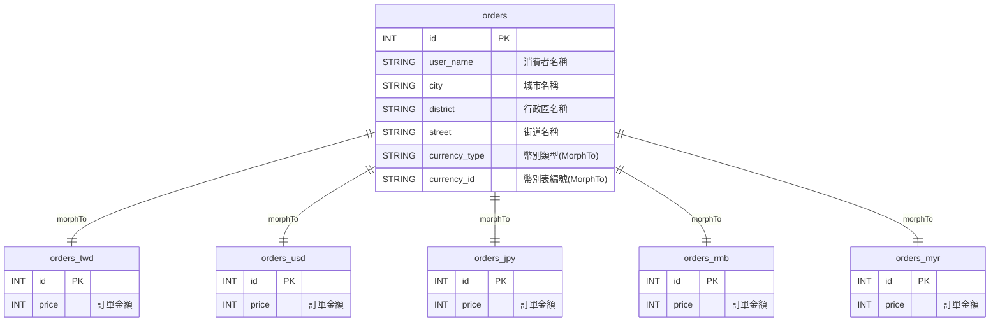
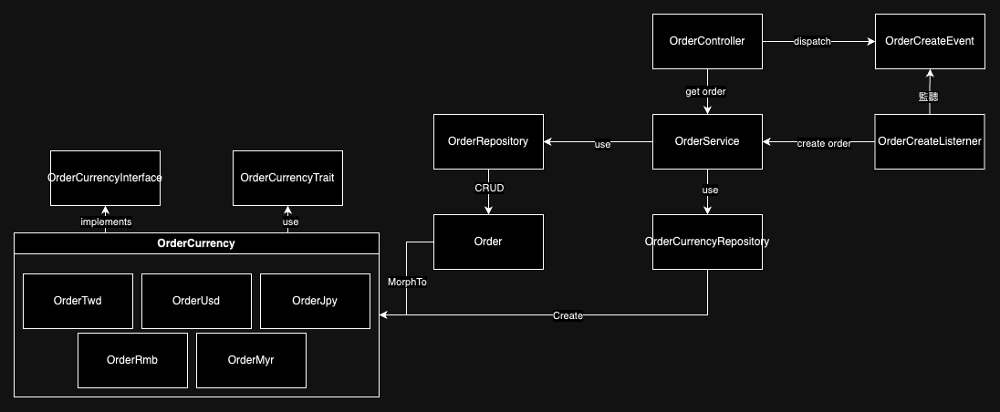

# SOILD 原則的使用

## 單一職責原則 (Single Responsibility Principle, SRP)：

> 各個類別單一職責

- [StoreOrderRequest](laravel-app/app/Http/Requests/StoreOrderRequest.php) 負責處理建立訂單的請求內容資料驗證
- [ShowOrderRequest](laravel-app/app/Http/Requests/ShowOrderRequest.php) 負責處理查詢訂單的請求內容資料驗證
- [OrderController](laravel-app/app/Http/Controllers/OrderController.php) 負責處理 HTTP 請求並觸發所需的 Service
- [OrderService](laravel-app/app/Services/OrderService.php) 負責處理與訂單相關的商業邏輯
- [OrderRepository](laravel-app/app/Repositories/OrderRepository.php) 與 [OrderCurrencyRepository](laravel-app/app/Repositories/OrderCurrencyRepository.php) 分別處理 [Order Model](laravel-app/app/Models/Order.php) 與 [`Order{幣別}`](laravel-app/app/Models/OrderCurrency/) 的資料連線邏輯

## 開放-封閉原則 (Open/Closed Principle, OCP)

> 1. 對於擴展是開放的 — 當需求變更時模組行為可以新增的
> 2. 對於修改是封閉的 — 當進行擴展時，不需修改既有的程式碼

當新增新的幣別資料表時，不需要異動 [OrderCurrencyRepository](laravel-app/app/Repositories/OrderCurrencyRepository.php)，只需要調整建立幣別表物件的 [OrderCurrencyFactory](laravel-app/app/Factories/OrderCurrencyFactory.php) 即可。

## 里氏替換原則 (Liskov Substitution Principle, LSP)：

> 子類別可以替代父類別而不影響程序的正確性。

例如，所有的 [`Order{幣別}`](laravel-app/app/Models/OrderCurrency/) 類別（如 `OrderTwd`, `OrderUsd`）都實現了 [`BasicCurrency`](laravel-app/app/Models/OrderCurrency/BasicCurrency.php)，可以在需要 OrderCurrencyInterface 的地方替代使用。

介面隔離原則 (Interface Segregation Principle, ISP)：
使用小而專用的接口來避免不必要的依賴。OrderCurrencyInterface 只包含與貨幣相關的方法，這樣使用者不需要依賴不需要的方法。
5. 依賴反轉原則 (Dependency Inversion Principle, DIP)：
高層模組不依賴於低層模組，而是依賴於抽象。例如，OrderService 依賴於 OrderRepository 和 OrderCurrencyRepository 的接口，而不是具體的實現，這樣可以更容易地進行測試和擴展。

使用接口和抽象類別來擴展功能而不修改現有代碼。例如，OrderCurrencyInterface 允許不同的貨幣類別實現相同的接口，這樣可以在不改變其他代碼的情況下添加新的貨幣類別。

# 設計模式的使用

---

# 面試資訊實作

本 Repository 將以 Laravel 11 進行「建立訂單 API」與「查詢訂單 API」之實作。

## 開發環境

請見 ./docker

## 專案程式碼

請見 ./laravel-app

## 需求內容

1. 實作一隻 POST API `/api/orders` 作為建立訂單 API
    1. 需要進行 request body 格式檢查
    2. 建立訂單過程需屬於非同步，回傳 200 後藉由 Events & Listener 的機制觸發資料建立
    3. 根據傳入的 `currency` 不同，會將資料傳入不同的資料表中
    4. `currency` 只會傳入以下五種資料
        1. `TWD` - 寫入 `orders_twd`
        2. `USD` - 寫入 `orders_usd`
        3. `JPY` - 寫入 `orders_jpy`
        4. `RMB` - 寫入 `orders_rmb`
        5. `MYR` - 寫入 `orders_myr`
2. 實作一隻 GET API `/api/orders/{id}` 作為查詢訂單 API
3. API 將以已知格式進行輸入，並使用 Laravel FormRequest 來實踐
4. 實作類別須符合物件導向設計原則 SOLID 與設計模式。並於該此專案的 README.md 說明您所使用的 SOLID 與設計模式分別為何。
5. 需撰寫 unit test 與 feature test 並覆蓋成功與失敗案例
6. 需要以 docker 包裝開發環境

## 資料庫設計

## 類別關係

此次提供兩隻 API

- `POST /api/order` : 建立訂單
- `GET /api/order/{id}` : 取得訂單

建立訂單時，會透過 Controller 觸發 Event，並由 Listener 處理訂單實質建立功能；取得訂單時則會直接從 Controller 透過 Service 向 Repository 進行資料庫操作來取得訂單結果。

在建立訂單的部分，由於需求上要求根據幣別寫入不同資料，但我期望在查詢訂單時能更高效且避免 id 重複的可能性，所以我建立了一張 `Order` 資料表負責價格以外的欄位，這意味著訂單編號也是存放在 `Order`。

而其他 `Order{幣別}` 則被我實作了 `OrderCurrencyInterface`，目的在於這些表結構與目的基本一致，所以我透過該 Interface 來驗證是否這些資料表都有實作所需 Function，並讓 Function 透過 `OrderCurrencyTrait` 的方式供這些幣別表實作。

而 `Order` 與 `Order{幣別}` 的關係，我採用 Morph 進行處理，所以當我要建立資料時，會區分成兩個階段：

1. 建立 `Order{幣別}`
2. 宣告 `Order` 並設定對應 `Order{幣別}` 後進行建立