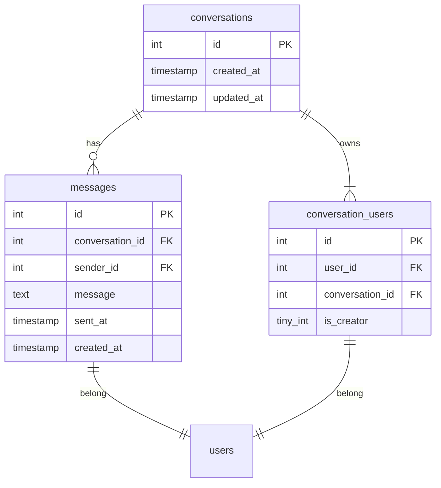
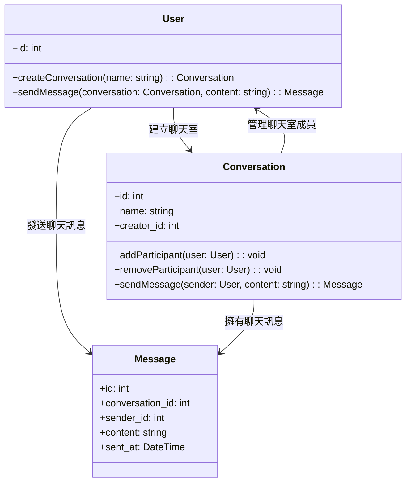

# 架構測驗

> 如果由您來規劃線上通訊服務，您會怎麼設計?請提供您的設計文件，並敘述您的設計目標。

## 資料表結構

在資料結構上，我們將其拆成三個主要區塊（不包含 `users` 表了話）：

1. conversations - 聊天室表
2. conversation_users - 聊天室成員表
3. messages - 純文字訊息表

每個聊天室會擁有一個或多個成員，每個成員都會

## 程式類別圖

這是一張簡易的程式類別圖，簡單表達每個角色之間的關係與會有的功能，在實作上會將這些功能再根據 SOLID 原則進行適當的拆分。

## 設計目標

1. 聊天室可以有多位成員
2. 成員們可以對聊天室發送訊息
    1. 訊息不可以被刪除或封存
    2. 聊天室不可以被刪除或封存
    3. 現階段只考慮純文字訊息且不考慮 Web 端以外的呈現平台
3. 暫時不提供封鎖功能

在訊息的發布上會採用觀察者模式，透過建立 MessageObserver 來觀察是否有一則新的訊息被建立，如果有了話就會進行對應的操作。這些對應的操作可能包含對觸發 Notification 並由 Notification 進行要發送的訊息管道方式觸發，諸如可能除了單純寫入 WebSocket 新訊息讓會員可以在前台查看最新訊息外，這些訊息根據需求也有可能會需要透過 Email 的方式發送給其他聊天室中的成員，讓成員們有除了即時聊天室以外的第二管道知道有最新訊息。

而在訊息的成立上，會傾向採用工廠模式來由 MessageFactory 來建立不同的訊息類型。這樣的好處在於當新增新的訊息時，我們能直接透過編輯工廠邏輯來避免影響核心邏輯，好修改也不容易因為新開發的內容造成問題。然而如果有需要發送純文字以外的訊息，那麼 `messages` 資料表中可能會需要以 `json` 格式儲存額外資料。這種格式在提供給 App 時能儲存更多的資料結構，讓 App 有辦法直接根據 Message 的額外資料進行不同方式的渲染。除了這樣外，當我們有需要提供功能性的訊息，諸如「查看訂單」或是「查看聯繫資訊」這類連結到其他功能頁面的功能時，透過 JSON 來紀錄額外參數能讓每則訊息能攜帶除了純文字以外的更多資訊來讓我們有辦法連結其他功能頁面時取出其他功能可能所需攜帶的參數。

在 Infra 上我們會主要建立在 WebSocket 上的機制，並搭配 Redis Queue 來實現訊息發送持續消化而不堵塞。
